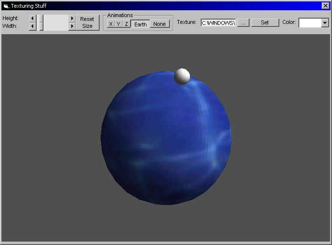



## A 3D Texturing/Animation/Effects Example\!  Best one of PSC\!

### Description

This tutorial has everything you need to create your own directx applications, it teaches how to create objects, make animations and effects, and even has a cool Earth & moon effect (see screenshot)! You can filter colors, and load your own textures, set v & h size too. If you like 3D Texturing v2 plz VOTE!!!
 
### More Info
 

             |
---                |---
**Submitted On**   |2002-02-07 19:11:10
**By**             |[SOLID4K TEAM](https://github.com/Planet-Source-Code/PSCIndex/blob/master/ByAuthor/solid4k-team.md)
**Level**          |Intermediate
**User Rating**    |4.0 (40 globes from 10 users)
**Compatibility**  |VB 5\.0, VB 6\.0
**Category**       |[DirectX](https://github.com/Planet-Source-Code/PSCIndex/blob/master/ByCategory/directx__1-44.md)
**World**          |[Visual Basic](https://github.com/Planet-Source-Code/PSCIndex/blob/master/ByWorld/visual-basic.md)
**Archive File**   |[A\_3D\_Textu53841272002\.zip](https://github.com/Planet-Source-Code/solid4k-team-a-3d-texturing-animation-effects-example-best-one-of-psc__1-31596/archive/master.zip)

